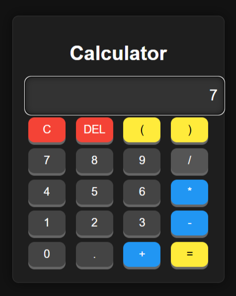

# Calculator-By-HTML-CSS-JS

## Overview
This is a simple calculator application built using HTML, CSS, and JavaScript.

## Output
Here is a preview of the calculator:

## Features
- **Basic Arithmetic Operations**: Perform addition, subtraction, multiplication, and division.
- **Keyboard Support**: Use your keyboard to input numbers and operators for a more efficient experience.
- **Responsive Design**: The calculator is designed to work well on both desktop and mobile devices.
- **Clear Button**: Reset the calculator with a single click.
